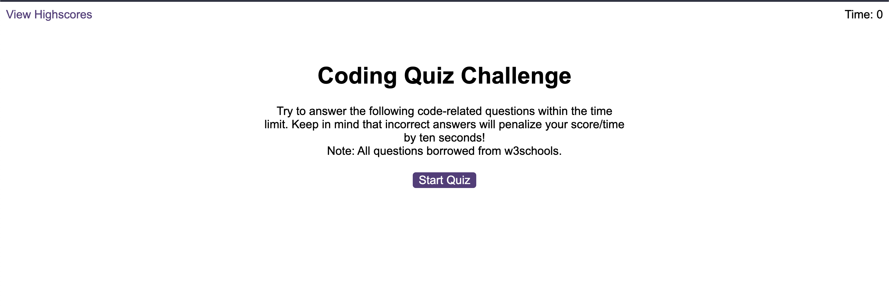

# Web-API-Code-Quiz
A project to create a javascript quiz application using built into the browser web APIs.

## Description

### Purpose
The purpose of this project was to further my understanding of javascript with web APIs, using  concepts such as localStorage, event listeners, methods and functions.

The task was to create a code quiz that contains the following requirements:
- A start button that when clicked a timer starts and the first question appears.
- Questions contain buttons for each answer.
- When answer is clicked, the next question appears
- If the answer clicked was incorrect then subtract time from the clock
- The quiz should end when all questions are answered or the timer reaches 0.
- When the game ends, it should display their score and give the user the ability to save their initials and their score
    
My Learnings
 - localStorage can be tricky to work with, having to convert from object to string and back again poses a number of unique challenges. All of which I resolved after some research.
 - creating elements dynamically on the page is a great way to add some interactivity to a page but does mean a lot of thought about about how and when things appear on a page and when to trigger them. I would definitely map this out before tackling the code next time.
 - All in all, the project was a good learning experience and helped to solidify my understanding of the key concepts of web APIs and how to use them effectively.

[Project Website](https://nailahmukhtar.github.io/Web-API-Code-Quiz).

## Usage
To view this in action, you can navigate to my [Project Website](https://nailahmukhtar.github.io/Web-API-Code-Quiz).

## Credits
Assignment provided by © 2022 edX Boot Camps LLC

## License
Not Applicable.
